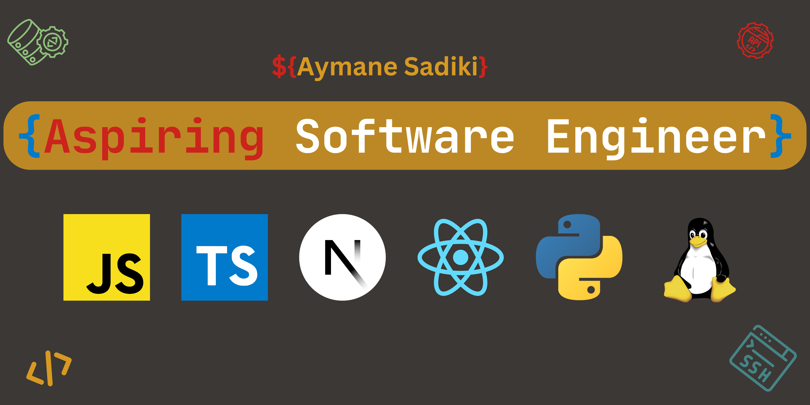

  
    

<!-- About me section -->

 I am a passionate software developer with expertise in building innovative, full-stack applications. After transitioning from a System Analyst Internship in the manufacturing industry, I pursued my passion for web development by completing an Information Systems degree and a Full Stack JavaScript Bootcamp. Proficient in modern technologies such as Next.js, TypeScript, and Tailwind CSS, I deliver elegant and efficient digital solutions. With strong skills across both frontend and backend,

<!-- Techinical Skills -->

### 
Technical Skills

  

  

<i>&nbsp; All growth depends upon activity</i>  

👋 Welcome, and thank you for visiting my GitHub! I'm Aymane Sadiki, a software engineer from Morocco, and I'm thrilled you're here to explore my work.

# Tech Stack 

| <samp>Tools & Technologies</samp>  | <samp>Badge</samp>                                                                                                                                                                                                                                                                                                                                                                                                                                                                                                                                                                                                                                                                                                                  |
| ---------------------------------- | ----------------------------------------------------------------------------------------------------------------------------------------------------------------------------------------------------------------------------------------------------------------------------------------------------------------------------------------------------------------------------------------------------------------------------------------------------------------------------------------------------------------------------------------------------------------------------------------------------------------------------------------------------------------------------------------------------------------------------------- |
| <samp>DevOps</samp>                |       |
| <samp>Cloud Platforms </samp>      |                                                                                                                                                                                                                                                                            |
| <samp>Operating System</samp>      |                                                                                                    |
| <samp>Programming Languages</samp> |                                                                                                                                                        |
| <samp>Frameworks</samp>            |                                                                                                                                                                                                                                                                                                                                                                                                                                                                                                                                                                                                                      |
| <samp>IDE</samp>                   |                                                                                                                                                                                                                                                                                                                                                     |
| <samp>Version Control</samp>       |                                                                                                                                                                                                                                                                                                                                                                                                                                                                                                                      |
| <samp>Servers</samp>               |                                                                                                                                                                                                                                                                                                                                                                                                                                                                                                          |
| <samp>Databases</samp>             |                                                                                                                                                                                                                                                                                                                                                                                                                                                                                                                                                                                                                            |

<!-- Hr is the line in between -->

   

# 📊 GitHub Stats:

## 🏆 GitHub Trophies

### ✍️ Random Dev Quote

---

<!-- Proudly created with GPRM ( https://gprm.itsvg.in ) -->
