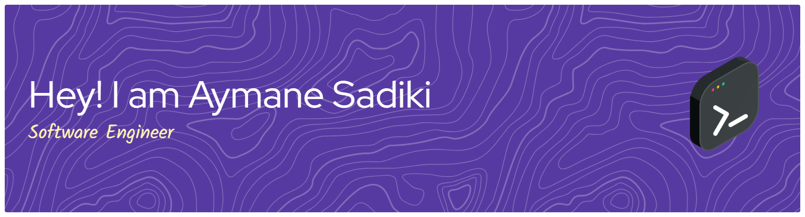

  

  <h1>Aymane Sadiki</h1>
  

    Software engineer from Morocco focused on full-stack products, cloud-native systems, and clean developer experience.
  

  

  

    
    
    
    
  

  

    
    
    
  

  

    <a href="#about">About</a> •
    <a href="#signature-areas">Focus</a> •
    <a href="#core-stack">Stack</a> •
    <a href="#toolbox">Toolbox</a> •
    <a href="#engineering-style">Approach</a> •
    <a href="#github-snapshot">Stats</a>
  

---

## About

<table>
  <tr>
    <td valign="top" width="64%">
      

        I build practical software with a strong bias toward reliability, clarity, and maintainability. My background spans product engineering, DevOps, and systems work, with hands-on experience across frontend delivery, backend services, cloud platforms, and deployment pipelines.
      

      

        I moved into software engineering after a system analyst internship in manufacturing, then sharpened that path through an Information Systems degree and a Full Stack JavaScript bootcamp. Today, I work comfortably across product and infrastructure, using the right level of complexity for the problem instead of chasing novelty.
      

      

        
        
        
      

    </td>
    <td valign="top" width="36%">
      <h3>At a Glance</h3>
      
Building thoughtful products, dependable delivery pipelines, and maintainable systems.

      

        
        
      

      

        
        
      

    </td>
  </tr>
</table>

## Signature Areas

  <table>
    <tr>
      <td valign="top" width="25%" align="center">
        <h3>Product Engineering</h3>
        
Building polished user-facing experiences with strong technical foundations.

        
        
      </td>
      <td valign="top" width="25%" align="center">
        <h3>Cloud Infrastructure</h3>
        
Designing environments that scale, deploy cleanly, and stay operable in production.

        
        
      </td>
      <td valign="top" width="25%" align="center">
        <h3>Developer Experience</h3>
        
Improving workflows, automation, and team velocity without adding unnecessary process.

        
        
      </td>
      <td valign="top" width="25%" align="center">
        <h3>Operational Visibility</h3>
        
Keeping systems observable, measurable, and easier to support over time.

        
        
      </td>
    </tr>
  </table>

  Building full-stack applications with modern web tooling, designing scalable delivery environments, and improving engineering workflows so products remain fast, maintainable, and dependable as they grow.

## Core Stack

  
   
  

  
  
  
  
  

  A stack chosen for delivery: modern web interfaces, automation-friendly backends, containerized deployment, and infrastructure that stays understandable.

## Toolbox

  <table>
    <tr>
      <td valign="top" width="50%">
        <h3>Frontend</h3>
        
Modern interfaces with multi-framework experience and a strong React ecosystem toolchain.

        

          
          
          
          
          
          
          
          
          
          
          
          
        

        
      </td>
      <td valign="top" width="50%">
        <h3>Backend</h3>
        
API development, automation, service design, and modern backend platform tooling.

        

          
          
          
          
          
          
          
        

        
      </td>
    </tr>
    <tr>
      <td valign="top" width="50%">
        <h3>DevOps</h3>
        
Deployment pipelines, infrastructure automation, and containerized operations.

        

          
          
          
          
          
        

        
      </td>
      <td valign="top" width="50%">
        <h3>Cloud</h3>
        
Azure-first delivery with practical experience across complementary platforms.

        

          
          
          
        

        
      </td>
    </tr>
    <tr>
      <td valign="top" width="50%">
        <h3>Systems</h3>
        
Reliable local workflows, source control, and day-to-day engineering tooling.

        

          
          
          
          
          
        

        
      </td>
      <td valign="top" width="50%">
        <h3>Data</h3>
        
Relational data platforms, hosted Postgres, and modern TypeScript ORM workflows.

        

          
          
          
          
          
          
          
        

        
      </td>
    </tr>
  </table>

## Building Right Now

  
  
  

<table>
  <tr>
    <td valign="top" width="33%">
      <h3>What I Optimize</h3>
      
Clarity in code, low-friction deployment, and interfaces that feel intentional.

    </td>
    <td valign="top" width="33%">
      <h3>What I Value</h3>
      
Maintainability, observability, and solutions that help teams move with confidence.

    </td>
    <td valign="top" width="33%">
      <h3>What I Avoid</h3>
      
Complexity without payoff, decorative tooling, and abstractions that hide the real problem.

    </td>
  </tr>
</table>

## Engineering Approach

- Prefer simple architectures that scale cleanly over early abstraction
- Treat performance, deployment, and maintainability as product concerns
- Keep interfaces polished, but keep systems observable and operable
- Work across the stack when that is what delivery requires

  
  
  
  

## GitHub Snapshot

  
  

  

  

